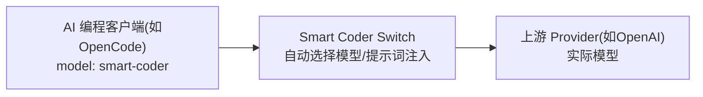
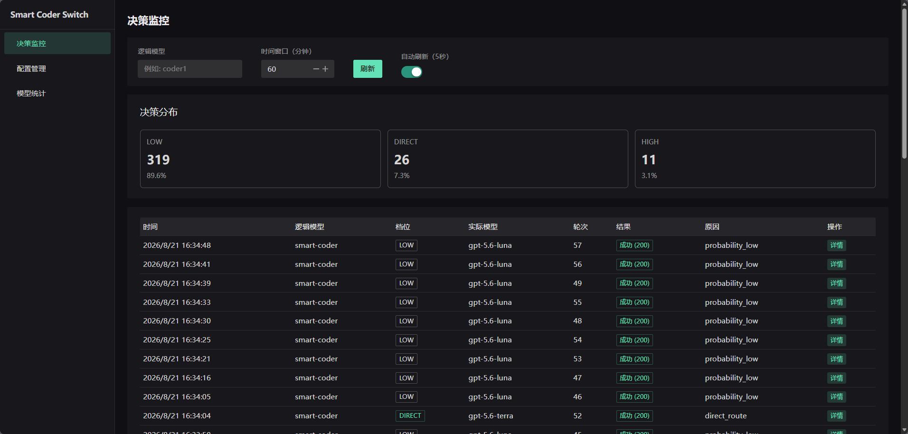
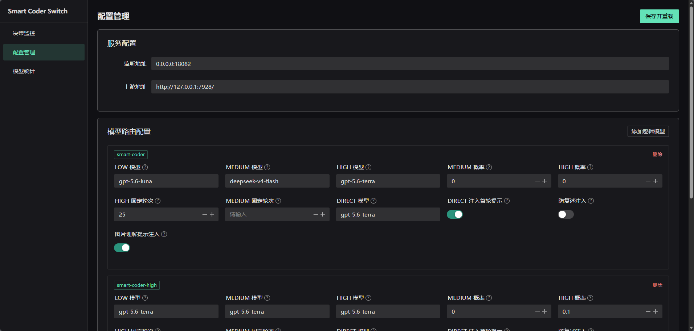

# Smart Coder Switch

> 给 AI 编程 Agent 用的模型路由代理：平时用便宜模型，按需切换到强模型。

## 有什么用

客户端始终填写一个模型名：

```text
smart-coder
```

Smart Coder Switch 会把请求转发到你配置的实际模型：



支持 OpenAI 兼容接口：

- `POST /v1/chat/completions`
- `POST /v1/responses`
- JSON 和 SSE 流式响应

所有请求都使用强模型，成本高；所有请求都使用便宜模型，复杂任务的效果可能不够好。Smart Coder Switch 用模型切换和 Prompt 注入解决这两个问题：日常请求使用便宜模型，复杂阶段切换到强模型，并自动补充对应提示。

概率路由也支持，但作为可选配置；不需要时将两个概率设为 `0` 即可。

## 工作原理

代理根据配置自动选择四类档位：

| 档位 | 行为 |
| --- | --- |
| LOW（默认） | 使用最经济的模型，不注入提示 |
| MEDIUM | 按 `medium-rounds` 固定轮次或 `medium-probability` 概率切换，只改模型 |
| HIGH | 按 `high-rounds` 固定轮次或 `high-probability` 概率切换，自动追加复盘 Prompt |
| DIRECT | 配置 `direct-model` 后，新任务入口强制使用该模型；默认追加首轮说明 Prompt |

DIRECT 和 HIGH 的提示都会提醒 Agent 检查 `available_skills` 中是否有适用的 Skill，仅在确实适用时才加载。

其他能力：

- **图片理解**：DIRECT 处理图片时，可先让强模型提取图片信息，后续交给不支持图片的便宜模型继续处理
- **配置热重载**：修改模型或轮次配置后，无需重启即可生效
- **Trace 与统计**：保存请求和路由结果，便于了解实际使用了哪个模型

### 一个直观例子

配置：

```yaml
models:
  smart-coder:
    low-model: gpt-5.6-luna
    medium-model: gpt-5.6-terra
    high-model: gpt-5.6-terra
    medium-rounds: 5
    high-rounds: 10
    medium-probability: 0
    high-probability: 0
    direct-model: gpt-5.6-sol
```

同一个客户端、同一个逻辑模型，代理会这样处理：

| 对话情况 | 实际模型 | 代理行为 |
| --- | --- | --- |
| 普通请求 | `gpt-5.6-luna` | 直接转发 |
| 第 5 个 assistant 回合 | `gpt-5.6-terra` | 切换模型，不额外注入 Prompt |
| 第 10 个 assistant 回合 | `gpt-5.6-terra` | 切换模型，追加复盘 Prompt，并提醒检查可用 Skill |
| 新任务入口，配置了 `direct-model` | `gpt-5.6-sol` | 切换模型，追加首轮说明 Prompt，并提醒检查可用 Skill |

客户端始终只发送：

```json
{"model":"smart-coder"}
```

不需要在客户端手动切换实际模型，也不需要手动编写复盘或首轮说明 Prompt。

## 快速开始

### 获取

| 平台 | 说明 |
| --- | --- |
| Windows | 下载 `smart-coder-switch.exe` + `config.example.yaml` |
| Linux / macOS | 下载对应平台的发布包，或从源码构建 |

从源码构建：

```bash
./scripts/build.sh
```

构建 Windows amd64 发布包：

```bash
GOOS=windows GOARCH=amd64 ./scripts/build.sh
```

### 配置服务端

将 `config.example.yaml` 复制为 `config.yaml`，编辑以下字段：

```yaml
listen:
  address: 127.0.0.1:18082

upstream:
  base-url: https://your-provider.example.com/
  timeout: 300

models:
  smart-coder:
    low-model: your-low-cost-model
    medium-model: your-medium-model
    medium-probability: 0
    high-model: your-powerful-model
    high-probability: 0
    medium-rounds: 5
    high-rounds: 10
    direct-model: your-powerful-model
```

- `low-model`：默认模型
- `medium-model`、`high-model`：按轮次切换的模型
- `medium-rounds`、`high-rounds`：切换轮次
- `medium-probability`、`high-probability`：可选的随机切换概率
- `direct-model`：DIRECT 强制路由模型（可选）

完整字段见 [`config.example.yaml`](config.example.yaml)。

启动服务：

```bash
# Linux / macOS
./smart-coder-switch -config ./config.yaml

# Windows
.\smart-coder-switch.exe -config .\config.yaml
```

首次启动会自动创建 `log/`、`log/traces/`、`data/` 目录。

### 连接客户端

在支持 OpenAI 兼容协议的客户端中填写：

```text
Base URL: http://127.0.0.1:18082/v1
Model: smart-coder
API Key: YOUR_UPSTREAM_API_KEY
```

客户端的 `Authorization` 请求头会原样转发给上游；代理不会保存 API Key。

**OpenCode 配置示例**：在 OpenCode 的 `providers.json` 中添加 Smart Coder Switch 作为 provider：

```json
{
  "provider": {
    "smart-coder": {
      "npm": "@ai-sdk/openai-compatible",
      "name": "smart-coder",
      "options": {
        "baseURL": "http://127.0.0.1:18082/v1",
        "apiKey": "sk-xxx"
      },
      "models": {
        "smart-coder": {
          "name": "smart-coder",
          "limit": {
            "context": 256000,
            "output": 32000
          },
          "modalities": {
            "input": ["text", "image"],
            "output": ["text"]
          }
        }
      }
    }
  }
}
```

使用时选择 `smart-coder` provider 下的 `smart-coder` 模型，代理会自动根据配置在 LOW / MEDIUM / HIGH / DIRECT 之间路由。

## 管理与监控

### Web 控制台

```text
http://127.0.0.1:18082/web/
```

控制台提供路由决策监控，可按逻辑模型和时间窗口筛选，并查看每次请求实际选择的模型、档位和触发原因。



配置管理页可在线调整服务地址、模型映射、固定轮次、概率和提示注入开关；保存后自动热重载。



> Admin 接口没有内置认证。建议只监听 `127.0.0.1`，或通过防火墙、反向代理限制访问。

### 安全边界

- Admin API 和 Web 控制台默认没有认证。
- 如果监听 `0.0.0.0`，任何能访问该端口的客户端都可能查看配置、统计和 Trace，并触发配置重载。
- 推荐仅监听 `127.0.0.1`；需要远程访问时，在可信反向代理后增加认证和网络访问控制。
- Trace 可能保存完整请求内容。共享日志或 Trace 前必须检查并脱敏。

## 设计文档

[Smart Coder Switch 架构与关键设计](docs/design.md)

## 许可证

[MIT License](LICENSE)
